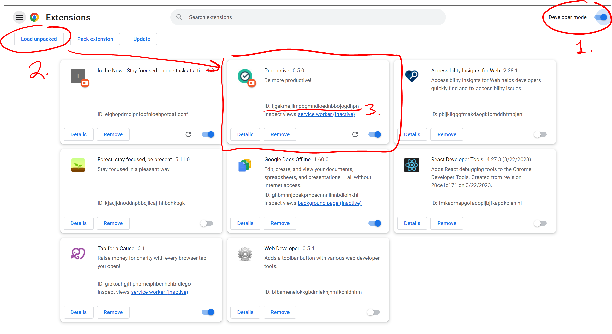

# Testing with Playwright

## Prerequisites

- update variable "EXTENSION_ID" in utils.js with your extension's ID. This extension ID can be found by opening the 'Manage Extensions' page in Chrome and finding this extension. See the below picture (particularly step 3).

## Running Tests

### tldr:
Tests are in the tests directory. To run them (in development)
1. start the program in development mode with `npm start`
2. make sure you are in the tests/ folder
3. run test(s)
  - run `npx playwright test` to run all tests in tests/, OR
  - run `npx playwright test {filename}` to run all tests within a specific file, OR
  - run `npx playwright test {filename}:{line_num} --project=chromium` to run a specific test (on line {line_num}) within a specific file (file {filename})
    - for example, if a line exists on line 240 in BlockedURLs.spec.js, you would run `npx playwright test BlockedURLs.spec.js:240 --project=chromium`

#### Notes:
- for some reason, sometimes running multiple tests results in a timeout error, even though the tests run individually without issue

### Longer version:
Tests are located in the tests/ directory.
Inside that directory, you can run several commands:

  npx playwright test
    Runs the end-to-end tests.

  npx playwright test --ui
    Starts the interactive UI mode.

  npx playwright test --project=chromium
    Runs the tests only on Desktop Chrome.

  npx playwright test example
    Runs the tests in a specific file.

  npx playwright test --debug
    Runs the tests in debug mode.

  npx playwright codegen
    Auto generate tests with Codegen.

Visit https://playwright.dev/docs/intro for more information. ✨